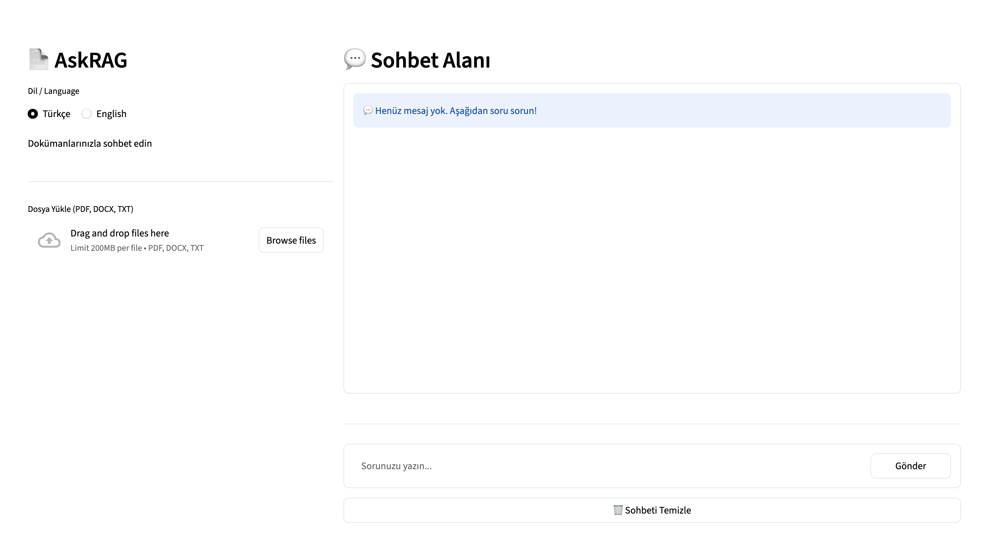
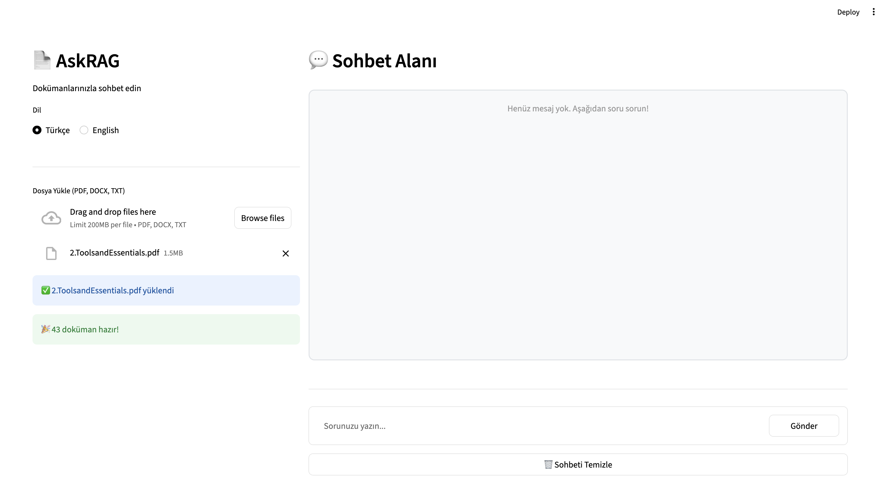
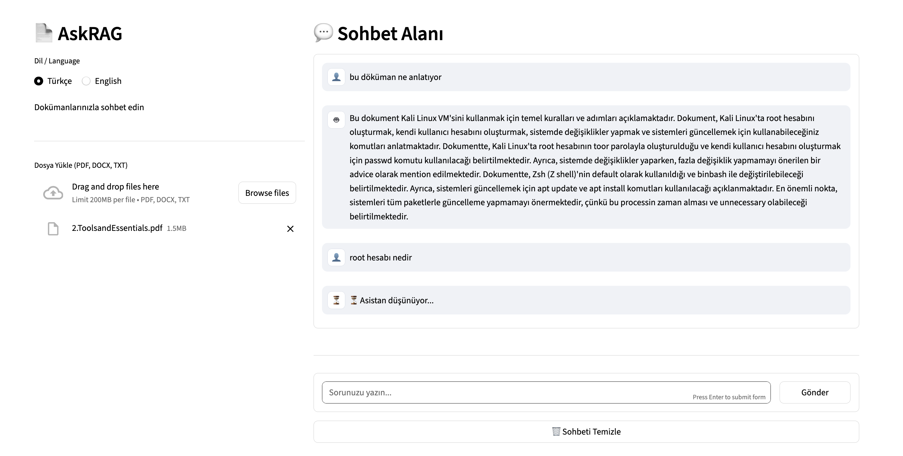
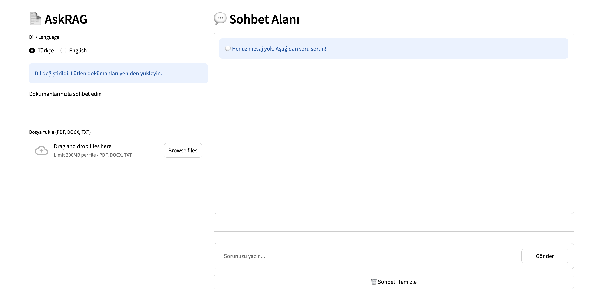
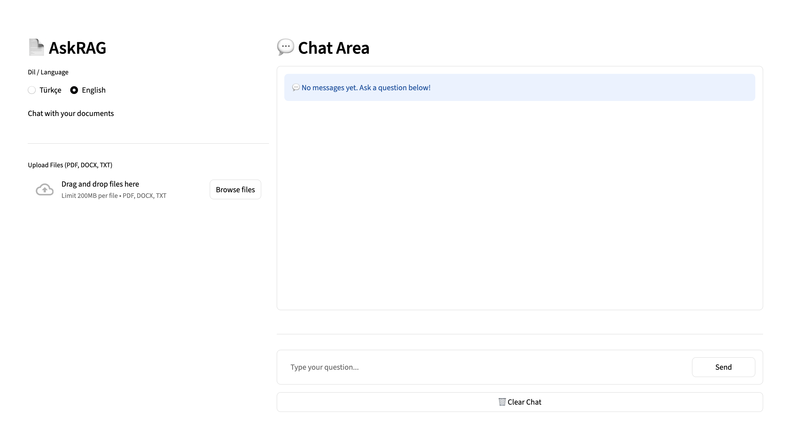
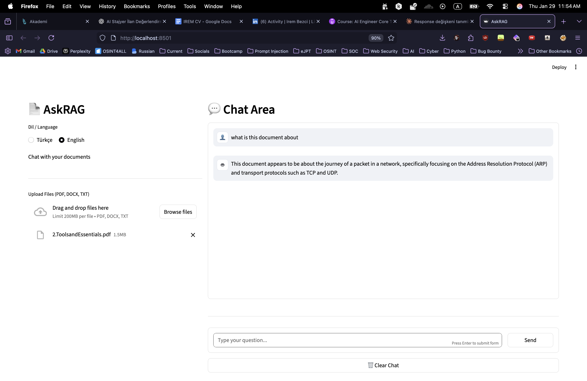
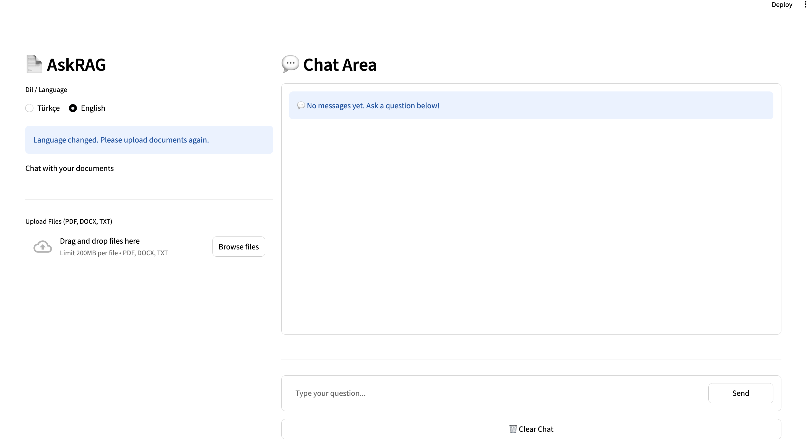

# 📄 AskRAG

AskRAG, dokümanlarınızla sohbet etmenizi sağlayan, Retrieval-Augmented Generation (RAG) tabanlı bir AI asistan uygulamasıdır.

## ✨ Özellikler

- 📁 **Çoklu Dosya Desteği**: PDF, DOCX ve TXT dosyalarını yükleyin
- 🌐 **Çift Dilli**: Türkçe ve İngilizce arayüz ve yanıt desteği
- 💬 **Sohbet Arayüzü**: Kullanıcı dostu chat interface
- 🔍 **Akıllı Arama**: Yüklediğiniz dokümanlardan ilgili bilgileri bulur
- 🤖 **Ollama Entegrasyonu**: Yerel AI modelleri kullanır

## 🚀 Kurulum

### Gereksinimler

- Python 3.8 veya üzeri
- Ollama ([Kurulum için](https://ollama.ai))

### Adımlar

1. **Repository'yi klonlayın:**
```bash
git clone https://github.com/irembezci/askrag-ai.git
cd askrag-ai
```

2. **Virtual environment oluşturun:**
```bash
python -m venv venv
source venv/bin/activate  # Mac/Linux
# veya
venv\Scripts\activate  # Windows
```

3. **Bağımlılıkları yükleyin:**
```bash
pip install -r requirements.txt
```

4. **Ollama modellerini indirin:**
```bash
ollama pull llama3.2
ollama pull nomic-embed-text
```

## 💻 Kullanım

Uygulamayı başlatın:
```bash
streamlit run app.py
```

Tarayıcınızda otomatik olarak `http://localhost:8501` açılacaktır.

### Nasıl Kullanılır?

1. **Dil Seçimi**: Türkçe veya English seçin
2. **Dosya Yükleme**: PDF, DOCX veya TXT dosyalarınızı sürükleyip bırakın
3. **Sohbet**: Dokümanlarınız hakkında sorular sorun
4. **Temizleme**: Sohbet geçmişini temizlemek için "Sohbeti Temizle" butonuna tıklayın

## 📁 Proje Yapısı
```
askrag-ai/
├── app.py                 # Ana uygulama
├── utils/
│   ├── loader.py         # Doküman yükleme
│   └── rag.py            # RAG mantığı
├── requirements.txt       # Python bağımlılıkları
├── .gitignore
└── README.md
```

## 🛠️ Teknolojiler

- **Streamlit**: Web arayüzü
- **LangChain**: RAG pipeline
- **Ollama**: Yerel AI modelleri
- **ChromaDB**: Vector database
- **FAISS**: Similarity search

## ⚙️ Yapılandırma

`utils/rag.py` dosyasından model ayarlarını değiştirebilirsiniz:
```python
# Model değiştirme
llm = ChatOllama(
    model="llama3.2",  # Farklı bir model kullanabilirsiniz
    temperature=0.2
)

# Chunk boyutu ayarlama
splitter = RecursiveCharacterTextSplitter(
    chunk_size=800,
    chunk_overlap=150
)
```
## 🇹🇷 Türkçe Kullanım Akışı

### 📌 Ana Ekran
Uygulama varsayılan olarak Türkçe arayüzle açılır.



### 📁 Dosya Yükleme
PDF, DOCX veya TXT dosyalarınızı sürükleyip bırakabilirsiniz.



### 💬 Dokümanlarla Sohbet
Yüklenen dokümanlar üzerinden doğal dilde sorular sorabilirsiniz.


### ⏳ Yanıt Oluşturma
Asistan yanıt üretirken durum bilgisi gösterilir.



### 🌐 Dil Değiştirme
Dil değiştirildiğinde dokümanların yeniden yüklenmesi istenir.




## 🤝 Katkıda Bulunma

1. Bu repository'yi fark edin
2. Feature branch oluşturun (`git checkout -b feature/AmazingFeature`)
3. Değişikliklerinizi commit edin (`git commit -m 'Add some AmazingFeature'`)
4. Branch'inizi push edin (`git push origin feature/AmazingFeature`)
5. Pull Request açın

## 📝 Lisans

Bu proje MIT lisansı altında lisanslanmıştır.

## 📧 İletişim

Sorularınız için [GitHub Issues](https://github.com/irembezci/askrag-ai/issues) kullanabilirsiniz.

## 🙏 Teşekkürler

- [LangChain](https://langchain.com)
- [Streamlit](https://streamlit.io)
- [Ollama](https://ollama.ai)

# 📄 AskRAG

AskRAG is a Retrieval-Augmented Generation (RAG)–based AI assistant application that allows you to chat with your documents.

## ✨ Features

- 📁 **Multi-File Support**: Upload PDF, DOCX, and TXT files
- 🌐 **Bilingual**: Turkish and English interface and response support
- 💬 **Chat Interface**: User-friendly chat interface
- 🔍 **Smart Search**: Finds relevant information from your uploaded documents
- 🤖 **Ollama Integration**: Uses local AI models

## 🚀 Installation

### Requirements

- Python 3.8 or higher  
- Ollama ([Installation](https://ollama.ai))

### Steps

## Clone the repository
```bash
git clone https://github.com/irembezci/askrag-ai.git
cd askrag-ai
```

## Create a virtual environment
```bash
python -m venv venv
source venv/bin/activate  # Mac/Linux
# or
venv\Scripts\activate  # Windows
```

## Install dependencies
```bash
pip install -r requirements.txt
```

## Download Ollama models
```bash
ollama pull llama3.2
ollama pull nomic-embed-text
```

## 💻 Usage

Start the application:
```bash
streamlit run app.py
```

Your browser will automatically open at `http://localhost:8501`.

### How to Use?

1. **Language Selection**: Choose Turkish or English  
2. **File Upload**: Drag and drop your PDF, DOCX, or TXT files  
3. **Chat**: Ask questions about your documents  
4. **Clear**: Click the "Clear Chat" button to clear the chat history  

## 📁 Project Structure
```
askrag-ai/
├── app.py                 # Main application
├── utils/
│   ├── loader.py         # Document loading
│   └── rag.py            # RAG logic
├── requirements.txt       # Python dependencies
├── .gitignore
└── README.md
```

## 🛠️ Technologies

- **Streamlit**: Web interface  
- **LangChain**: RAG pipeline  
- **Ollama**: Local AI models  
- **ChromaDB**: Vector database  
- **FAISS**: Similarity search  

## ⚙️ Configuration

You can change the model settings from the `utils/rag.py` file:
```python
# Change model
llm = ChatOllama(
    model="llama3.2",  # You can use a different model
    temperature=0.2
)

# Adjust chunk size
splitter = RecursiveCharacterTextSplitter(
    chunk_size=800,
    chunk_overlap=150
)
```

## 🇬🇧 English Usage Flow

### 📌 Main Screen
The interface can be switched to English from the language selector.



### 💬 Chat with Documents
Ask questions about your uploaded documents in English.



### 🌐 Language Change Warning
When the language is changed, documents must be re-uploaded.




## 🤝 Contributing

1. Fork this repository  
2. Create a feature branch (`git checkout -b feature/AmazingFeature`)  
3. Commit your changes (`git commit -m 'Add some AmazingFeature'`)  
4. Push your branch (`git push origin feature/AmazingFeature`)  
5. Open a Pull Request  

## 📝 License

This project is licensed under the MIT License.

## 📧 Contact

For questions, please use [GitHub Issues](https://github.com/irembezci/askrag-ai/issues).

## 🙏 Acknowledgements

- [LangChain](https://langchain.com)  
- [Streamlit](https://streamlit.io)  
- [Ollama](https://ollama.ai)  


